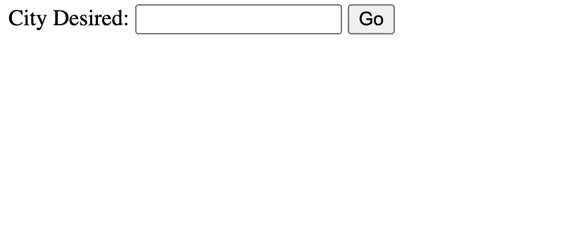
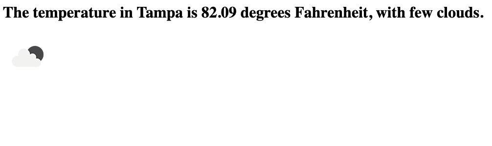

# Weather API
Making my First API to retrieve Weather Data

## Description:

This was the first time having the pleasure of making a Application Programming Interface (API). For this API I used openweather.org to request the weather of any specific city within the United States and would display post that to my server's browswer. This was a really cool way to see what you can do with an API first hand. I once again look forward to working with more API's and gaining additional experence working with API's 🙂

